<table>
<tr>
<td>
<a href= "https://www.btgpactual.com/"></a>
</td>
<td><a href= "https://www.inteli.edu.br/"></a>
</td>
</tr>
</table>

<font size="+12"><center>
Reinforcement Matching
</center></font>

**Conteúdo**

- [Entendimento do Contexto do Problema](#entendimento-do-contexto-do-problema)
- [Entendimento da Experiência do Usuário](#entendimento-da-experiência-do-usuário)
  - [Persona](#persona)
  - [User Stories](#user-stories)
  - [Jornada do Usuário](#jornada-do-usuário)
- [Entendimento do Negócio](#entendimento-do-negócio)
    - [Descrição da Solução a ser Desenvolvida](#descrição-da-solução-a-ser-desenvolvida)
        - [Problema](#problema)
        - [A Solução Proposta](#a-solução-proposta)
        - [Utilização da Solução](#utilização-da-solução)
        - [Benefícios](#benefícios)
    - [Matriz de Riscos](#matriz-de-riscos)
        - [Ameaças](#ameaças)
        - [Oportunidades](#oportunidades)
  - [Contexto da Indústria](#contexto-da-indústria)
    - [Principais players, modelo de negócio e tendências](#principais-players-modelo-de-negócio-e-tendências)
    - [5 forças de Porter](#5-forças-de-porter)
  - [Value Proposition Canvas](#value-proposition-canvas)
  - [Matriz SWOT](#matriz-swot)
- [Relatório Técnico](#relatório-técnico)
  - [Análise dos dados](#análise-dos-dados)
  - [Mapeamento do Ambiente e Elementos-Chave](#mapeamento-do-ambiente-e-elementos-chave)
    - [Introdução](#introdução)
    - [Definição dos Elementos-Chave](#definição-dos-elementos-chave)
        - [Ambiente](#ambiente)
        - [Ações](#ações)
        - [Recompensas](#recompensas)
        - [Estado](#estado)
    - [Conclusão](#conclusão)
- [Modelagem do Problema e Definição da Solução](#modelagem-do-problema-e-definição-da-solução)
  - [Escolha da abordagem de otimização](#escolha-da-abordagem-de-otimização)
    - [Alterações nos elementos chaves](#alterações-nos-elementos-chaves)
    - [Passo a passo de execução do agente](#passo-a-passo-de-execução-do-agente)
    - [Passo a passo de treinamento do agente](#passo-a-passo-de-treinamento-do-agente)
    - [Estrutura da Rede Neural](#estrutura-da-rede-neural)
  - [Proposta de funções de recompensa](#proposta-de-funções-de-recompensa)
    - [Funções auxiliares](#funções-auxiliares)
      - [Função `calcular_cdi`](#função-calcular_cdi)
        - [TESTE PROPOSTO](#teste-proposto)
      - [Função `avaliar_cdi_e_variancia`](#função-avaliar_cdi_e_variancia)
      - [Função `recompensa_1`](#função-recompensa_1)
      - [Contexto e Conclusão](#contexto-e-conclusão)
      - [Função `recompensa_2`](#função-recompensa_2)
      - [Função `recompensa_3`](#função-recompensa_3)
      - [Função `recompensa_4`](#função-recompensa_4)
- [Relatório Final](#relatório-final)
  - [Descrição do Problema](#descrição-do-problema)
  - [Solução Desenvolvida](#solução-desenvolvida)
  - [Resultados Obtidos](#resultados-obtidos)
  - [Aprendizagem durante a construção do Projeto](#aprendizagem-durante-a-construção-do-projeto)
- [Referências bibliográficas](#referências-bibliográficas)

# Entendimento do Contexto do Problema

# Entendimento da Experiência do Usuário

## Persona
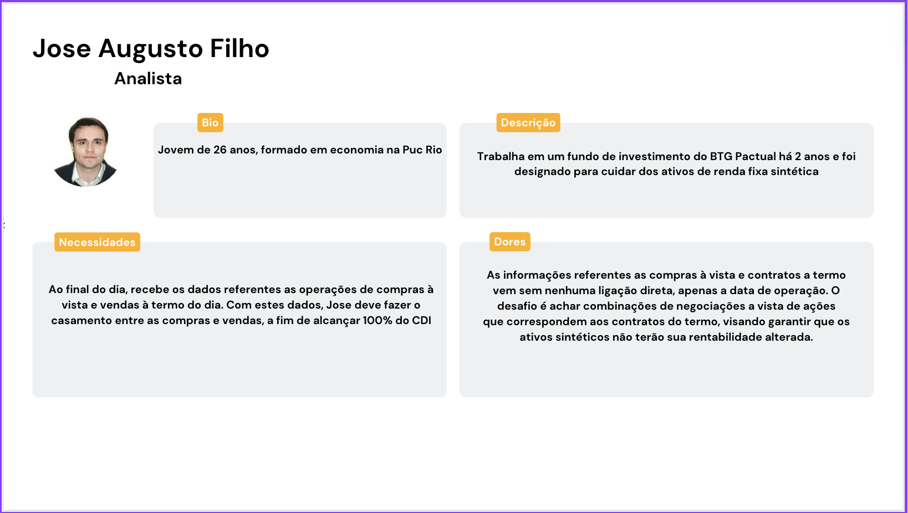

## User Stories
User stories são uma técnica utilizada no desenvolvimento ágil de software para capturar requisitos de sistema de uma perspectiva do usuário final. Elas são descrições curtas e simples, geralmente escritas de forma informal, que explicam uma funcionalidade ou característica desejada do ponto de vista do usuário.

Cada user story foca em entregar valor ao usuário, detalhando o que ele deseja alcançar com o sistema. Elas são acompanhadas de critérios de aceitação para esclarecer o que é necessário para a história ser considerada completa, facilitando o entendimento, a priorização e a implementação eficaz das funcionalidades pelo time de desenvolvimento.

Abaixo, temos um recorte das principais user stories para a Sprint 1. Ao tratar-se de um artefato ligado à metologia ágil, é normal que a tabela se adapte com o decorrer do projeto. As User Stories podem ser [acompanhadas através da planilha no Google Sheets](https://docs.google.com/spreadsheets/d/1YMPq4jfW3k3dJnOaYEJNw-1TdeRRYmVzLEdR1J8A7AA/edit?usp=sharing).


## Jornada do Usuário
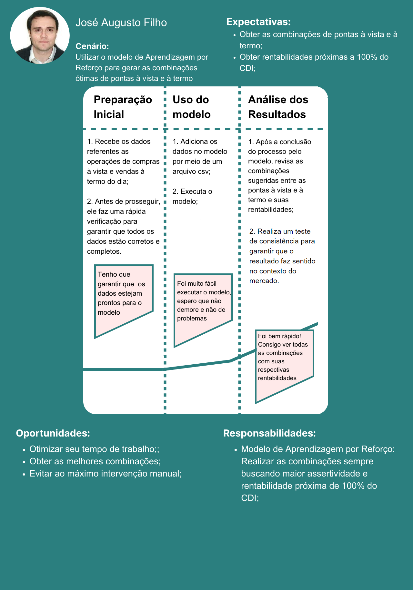

# Entendimento do Negócio

### Descrição da Solução a ser Desenvolvida

##### Problema

Para a criação do ativo sintético é ocorrido uma negociação de contrato a termo dentre a ponta vista (agrupamento de operações) e a ponta termo com uma rentabilidade que gira em torno de 100% do CDI (certificado de depósito interbancário). Atualmente, o administrador do fundo utiliza, de forma manual, o Excel como ferramenta para a seleção dos agrupamentos que façam mais sentido para a aproximação de 100% do CDI em relação a quantidade de ações que foram negociadas no termo em evidência, no entanto a garantia de uma precificação confiável para o ativo nem sempre é atingida, além da falta de assertividade, em alguns casos, em relação ao conjunto de operações plausíveis haver muitas distinções entre elas em sentido de valores de CDI, ou seja, os valores são distantes e não possuem uma forma de equalização podendo, consequentemente, ocorrer casos de transferência de riqueza.

##### A Solução Proposta

A solução proposta tratasse de utilizar o Deep Learning, mais precisamente, a aprendizagem por reforço como principal entregável. Este método de aprendizagem, seria, basicamente, um modelo matemático que possuiria um agente que, por meio de um objetivo (agrupamento de ações para a proximidade com o 100% do CDI) seria proposta uma estratégia, respeitando as restrições impostas pelo cliente, para garantir a melhor precificação durante e após o treinamento dentre a rede neural. Por fim, a utilização do modelo partirá de uma interface gráfica ,simplificada, integrada na nuvem que permitirá a inserção dos dados do contrato a termo e a saída, pós processamento da rede neural, com as informações da média de preço das ações escolhidas da ponta vista com o preço médio do grupo dentro da ponta a termo.

##### Utilização da Solução

Aprofundando na solução proposta acima, a utilização da aplicação será, inicialmente, que o usuário implementará seus dados dentro da interface, após isso, ocorrerá os processamentos necessários até que o agente agirá usando o aprendizado por reforço para encontrar a combinação de ações adequadas para a precificação do ativo sintético aproximado a 100% do CDI, para tal feito, ocorrerá comparações dentre os agrupamentos, aqueles que garantem maior assertividade, de modo que o escolhido se alinhe com a estratégia de aproximixação do valor esperado, essa aproximação se relaciona com o objetivo final do valor de precificação aguardado. Ademais, pós passagem pela rede neural, o usuário receberá duas saídas, a primeira tratasse dos dados de preço média da ponta vista com o preço médio da ponta termo com possibiliadde de download, e a outra saída, será uma visualização gráfica que justifique a escolha do agrupamento usando como argumento nossa estratégia de qual conjunto de operações faria mais sentido dentre as possibilidades.

##### Benefícios

Após uma breve explicação do essencial dentre a solução, abaixo haverá uma listagem dos principais benefícios ganhos pelas funcionalidades do entregável:

- Minimização do trabalho manual (A rede neural por aprendizagem com reforço mitigará a intervenção humana na combinatória das ações);

- Escalabilidade (Devido a aplicação estar na nuvem, a aplicação estará expansível para aguentar grande carga de dados);

- Precificação confiável (A rede neural irá ser treinada para que atinga maior quantidade de resultados significativos e que faça sentido para as regras de negócio);

- Mitigação da transferência de riqueza (Ao garantir que os agrupamentos de ações não se diferenciam muito quanto ao valor atingido de CDI dentre cada uma);

### Matriz de Riscos

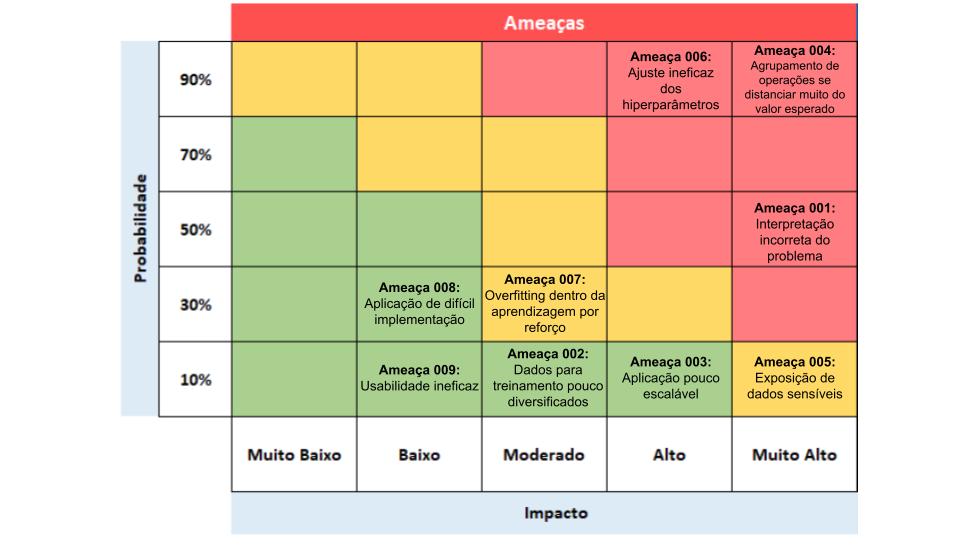

##### Ameaças

1. Interpretação incorreta do problema.

   - Justificativa: Poderia haver a impossibilidade da incompreensão afetar a construção da solução como um todo;
   - Mitigação: Alinhamento constante com os clientes;

2. Dados para treinamento pouco diversificados.

    - Justificativa: Poderia haver a possibilidade dos dados seguirem um padrão limitado, e assim, mitigando o potencial do modelo de achar possibilidades;
    - Mitigação: Alinhar com o cliente pedido mais carga de dados, caso haja necessidade;

3. Aplicação pouco escalável.

    - Justificativa: Aplicação poderia conter recursos limitados para aguentar grande carga de dados;
    - Mitigação: Gerenciar os recursos da melhor maneira decorrentes do serviço de nuvem utilizado;

4. Agrupamento de operações se distanciar muito do valor esperado.

    - Justificativa: Os conjuntos plausíveis serem muito distantes do valor de 100% do CDI, ou os conjuntos terem uma diferença de valor muito grande;
    - Mitigação: Ajuste constante dos pesos e dos hiperparâmetros;

5. Exposição dos dados sensíveis.

    - Justificativa: Devido a tabela conterem dados sensíveis de investimento, comprometer esses dados diminuiria a integridade do banco;
    - Mitigação: Manter o cuidado e confidencialidade dos dados;

6. Ajuste ineficaz dos hiperparâmetros.

    - Justificativa: Construção redundante da rede neural sem necessidade;
    - Mitigação: Durante o treinamento, realizar observações em relação a arquitetura da rede neural e encontrar pontos desnecessários;

7. Overfitting dentro da aprendizagem por reforço.

    - Justificativa: Modelo estar limitado a apenas combinar uma certa quantidade de possibilidade;
    - Mitigação: Garantir que a rede neural em geral esteja alinhada a abranger grande diversidade e modificações internas em sua arquitetura durante os seus testes;

8. Aplicação de difícil implementação.

    - Justificativa: Poderá haver a possibilidade que os recursos e o custo de tempo para a implementação da solução sejam significativos;
    - Mitigação: Gerenciar os recursos mantendo a performance num nível ótimo;

9. Usabilidade ineficaz.

    - Justificativa: A interface gráfica pode não ser tão intuitiva, de modo que aumente a curva de aprendizagem do usuário;
    - Mitigação: Simplicação da interface e o uso dos princípios do WCAG;

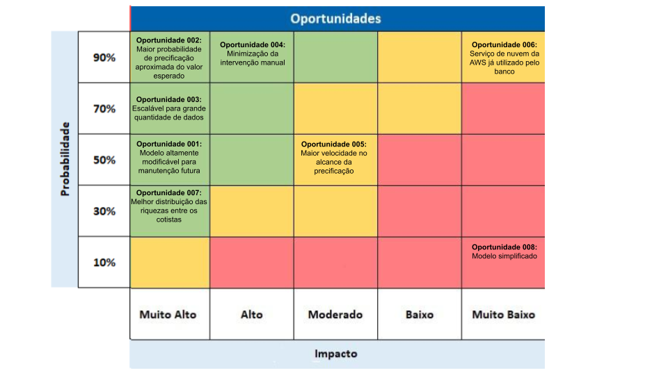

##### Oportunidades

1. Modelo altamente modificável para manutenção futura:

    - Justificativa: Garantir que o modelo esteja documentado;
    - Como aproveitar: Devido ao modelo ter uma documentação bem assertiva, é possível garantir que o time que for fazer a manutenção ou ajustes tenha facilidade durante sua intervenção;

2. Maior probabilidade de precificação aproximada do valor esperado:

    - Justificativa: Meta principal do projeto, em que o agrupamento de ações tenha aproximação de 100% do CDI;
    - Como aproveitar: Geração de confiança com modelo gerando agrupamentos mais assertivos com o objetivo;

3. Escalável para grande quantidade de dados.

    - Justificativa: A aplicação deve aguentar grande carga de dados durante o seu processamento;
    - Como aproveitar: Será possível aumentar a quantidade de dados visando um dos objetivos da solução, e haverá facilidade de gerenciar os recursos caso haja necessidade;

4. Minimização da intervenção manual.

    - Justificativa: Processo automatizado proposto pelo modelo;
    - Como aproveitar: Diminuição da intervenção na combinatória, devido ao processo automatizado trazido pelo Deep Learning;

5. Maior velocidade no alcance da precificação.

    - Justificativa: Melhorar a perfomance podendo demonstrar oportunidades de extensão;
    - Como aproveitar: Gerenciamento dos recursos e ajustes constantes dos hiperparâmetros para garantir sempre a alta performance, sendo benéfico para o banco, pois garante maior velocidade no dia a dia.

6. Serviço de nuvem da AWS já utilizado pelo banco.

    - Justificativa: Serviço da nuvem já sendo utilizado pelas aplicações do próprio banco;
    - Como aproveitar: Rápida implementação da solução nos serviços do banco devido ao alinhamento com as tecnologias já pré utilizadas;

7. Melhor distribuição das riquezas entre os cotistas.

    - Justificativa: Garantir que os agrupamentos de ações não se distanciem dentre eles garantindo confiabilidade e assertividade na combinatória e mitigando a transferência de riqueza;
    - Mitigação: Oportunidade do banco de garantir para seus cotistas boa administração sob as operações;

8. Modelo simplificado.

    - Justificativa: Um modelo simplificado poderia garantir maior velocidade de intervenção para ajustes;
    - Mitigação: A equipe futura poderia usufruir dessa característica do modelo e sempre garantir melhorias;

## Contexto da Indústria

O BTG Pactual é o maior banco de investimento da América Latina e referência global. Fundado em 1983 e sediado no Brasil, o banco se destaca por sua abordagem inovadora e foco em soluções personalizadas e tecnológicas para clientes institucionais e individuais. Ao longo dos anos, o BTG Pactual consolidou sua reputação como um dos principais players do mercado financeiro, oferecendo uma ampla gama de produtos e serviços especializados, contribuindo assim significativamente para o cenário financeiro dinâmico no Brasil e em escala global.

### Principais players, modelo de negócio e tendências

O BTG Pactual enfrenta uma concorrência acirrada no cenário financeiro brasileiro, competindo com players diversos como a XP Inc., o Itaú Unibanco e bancos internacionais que atuam no Brasil, como o JPMorgan Chase. A XP, com sua presença marcante como corretora de investimentos, desafia o BTG Pactual em oferecer soluções inovadoras e acessíveis para investidores individuais. O Itaú, como uma das maiores instituições financeiras do país, representa uma competição significativa, especialmente em serviços bancários tradicionais e de varejo, sendo o banco brasileiro mais valioso da B3. Enquanto isso, a presença de bancos internacionais como o JPMorgan destaca o potencial e maturidade do mercado financeiro brasileiro, desafiando o BTG Pactual a equilibrar a competição local com a global. Essa dinâmica competitiva impulsiona a busca contínua por inovação e diferenciação no mercado financeiro brasileiro.

Em relação ao modelo de negócios do banco, destaca-se pela sua abrangência, sendo um banco de investimentos global. Sua atuação abrange diversas vertentes, como gestão de ativos e fundos, private banking, fusões e aquisições, serviços corporativos, entre outros, se destacando tanto por oferecer soluções para clientes institucionais quanto individuais. No segmento de banco de investimento, o BTG Pactual desempenha um papel significativo em assessorar fusões e aquisições, fornecer serviços de underwriting, além de atuar como intermediário em mercados financeiros. Sendo assim, seus clientes incluem investidores institucionais, empresas, governos e indivíduos de alta renda, buscando serviços financeiros e estratégias de investimento personalizadas.

Por fim, têm-se que no contexto global a intensa digitalização dos serviços financeiros e a ascensão das fintechs, forçando o BTG a aprimorar constantemente suas ofertas digitais para se manter competitivo. Além disso, a empresa busca expandir seu alcance e fortalecer parcerias estratégicas, enquanto investe em tecnologias emergentes para aprimorar a eficiência operacional e a experiência do cliente. Essas tendências refletem o compromisso do BTG em se adaptar a um ambiente dinâmico, incorporando inovações e alinhando-se às expectativas do mercado e dos investidores.

### 5 forças de Porter

As **Cinco Forças de Porter** representam um modelo para analisar o ambiente competitivo de uma indústria, incluindo o **poder de negociação dos fornecedores**, **dos compradores**, a **ameaça de produtos ou serviços substitutos**, a **intensidade da rivalidade entre concorrentes** e as **barreiras à entrada de novos competidores**. A importância desse modelo é fornecer uma estrutura para entender as forças que moldam a competitividade de um setor, auxiliando as empresas na formulação de estratégias para se destacarem em seus mercados.

**1º Poder de Negociação dos Fornecedores:** No setor financeiro, o BTG Pactual pode ter forte poder de negociação, uma vez que se caracteriza como um dos principais bancos de investimento.

**2º Poder de Negociação dos Compradores:** Os clientes do BTG Pactual, sejam eles institucionais ou individuais, possuem algum poder de negociação, especialmente considerando a variedade de opções disponíveis no mercado, além de que é valorizado pelo banco um serviço personalizado aos clientes.

**3º Ameaça de Produtos ou Serviços Substitutos:** Há um risco de surgimento de outros serviços substitutos, uma vez que o mercado de fintechs no Brasil está cada vez mais desenvolvido, o que força o BTG a investir em inovação, para assim enfrentar a concorrência e oferecer propostas inovadoras de valor únicas.

**4º Intensidade da Rivalidade entre Concorrentes Existentes:** A competição no setor bancário e de investimentos é alta, principalmente com grandes bancos nacionais e internacionais presentes no Brasil. Sendo assim, a inovação, agilidade e oferta de serviços diferenciados são essenciais para se destacar, pontos esses que o BTG demonstra investir recursos para serem melhorados.

**5º Barreiras à Entrada de Novos Concorrentes:** O setor financeiro é caracterizado por barreiras significativas e burocracias complexas, como regulamentações rigorosas, requisitos de capital elevados e a necessidade de uma reputação consolidada. Portanto, conclui-se que é um mercado com alta barreira à novos entrantes.

## Value Proposition Canvas
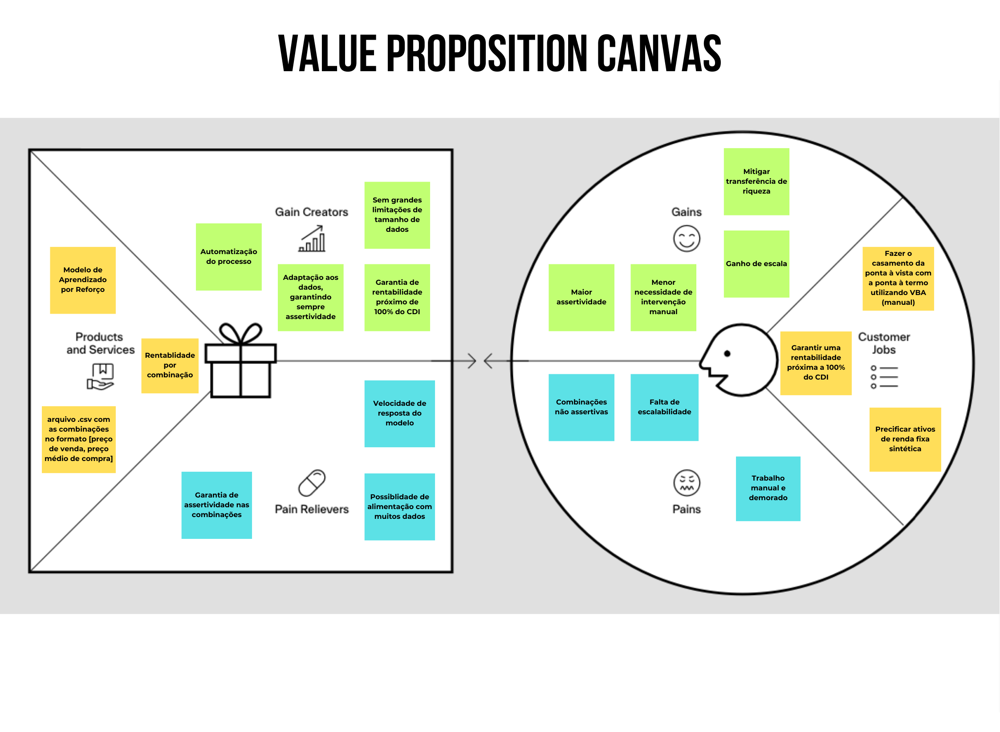

## Matriz SWOT
A Matriz SWOT, ou Matriz FOFA, é uma ferramenta de planejamento estratégico essencial para identificar as Forças, Fraquezas, Oportunidades e Ameaças em um projeto ou empreendimento. Ela permite uma avaliação abrangente dos fatores internos e externos que influenciam uma iniciativa, fundamentais para a tomada de decisões estratégicas, aprimoramento de desempenho e gestão de riscos.

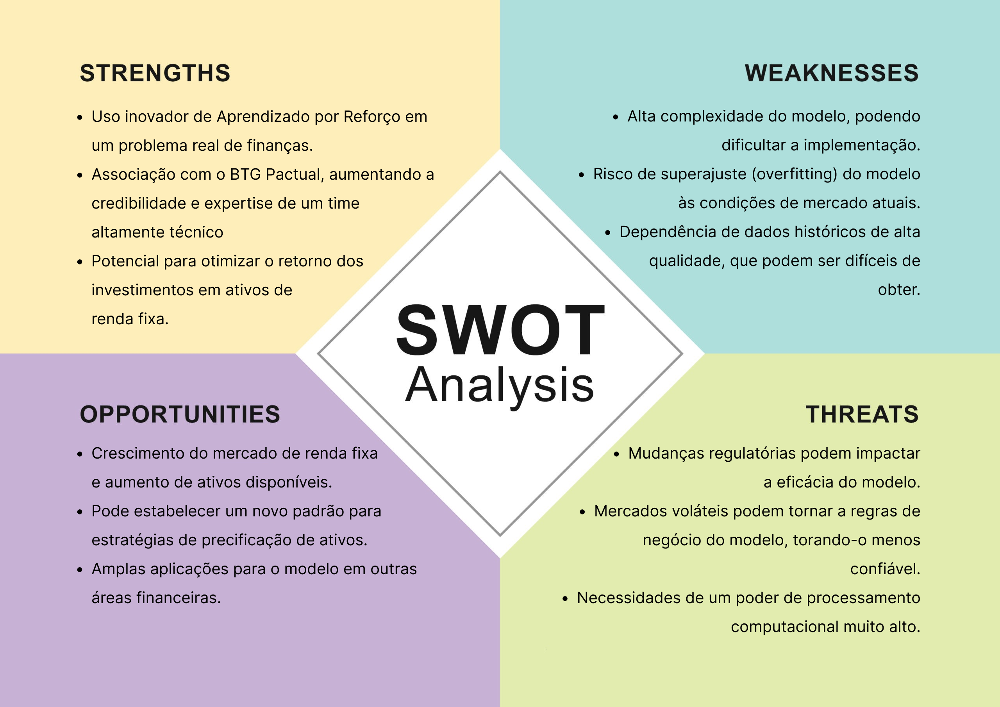

Utilizando esta ferramenta para uma análise estratégica de nossa solução frente ao mercado, identificamos pontos cruciais. A aplicação inovadora de Aprendizado por Reforço em finanças é uma força notável, particularmente na otimização de retornos de investimentos em ativos de renda fixa. A parceria com o BTG Pactual endossa o projeto com uma credibilidade inestimável e a expertise de um time técnico altamente especializado, sinalizando um potencial substancial para aprimorar estratégias de investimento e otimizar efetivamente os retornos.

Por outro lado, enfrentamos desafios significativos. A complexidade do modelo proposto pode ser uma barreira à implementação prática, e existe o risco de superajuste às condições atuais de mercado, o que poderia reduzir sua eficácia em ambientes variáveis. A dependência de dados históricos de alta qualidade, nem sempre disponíveis, também é uma preocupação.

No entanto, as oportunidades são estimulantes. O crescimento do mercado de renda fixa e a emergência de novos ativos apresentam a possibilidade de estabelecer novos padrões em estratégias de precificação de ativos. Além disso, o modelo tem potencial de aplicação em várias áreas financeiras.

# Relatório Técnico
## Análise dos dados
A análise de dados históricos desempenha um papel crucial em muitos campos da ciência e da tecnologia, fornecendo _insights_ valiosos sobre padrões, tendências e comportamentos passados que podem influenciar o desenvolvimento de soluções técnicas. No contexto do aprendizado por reforço, uma área da inteligência artificial dedicada ao treinamento de agentes para tomar decisões otimizadas em ambientes dinâmicos, a análise de dados históricos pode ser tanto relevante quanto dispensável, dependendo das características específicas do problema em questão.
Entretanto, com relação ao desafio enfrentado no que diz respeito à “Otimização de Precificação visando alcançar 100% do CDI em Ativos de Renda Fixa” é de suma importância um olhar mais aberto para a ferramenta _RL_ (_Reinforcement Learning_), visto que a mesma pode trazer uma série de vantagens no negócio e nesta área específica do mercado financeiro, podemos citar pelo menos 6 delas:
1. **Adaptação Dinâmica**: O mercado financeiro é altamente dinâmico e sujeito a mudanças rápidas. O _RL_ permite que o sistema de precificação se adapte automaticamente a novas condições de mercado, ajustando as estratégias de investimento de acordo com a evolução das taxas de juros e outras variáveis relevantes.
2. **Exploração de Estratégias Complexas**: O _RL_ é capaz de explorar e aprender estratégias de investimento complexas que podem não ser facilmente capturadas por modelos tradicionais. Isso inclui a consideração de múltiplos fatores, como volatilidade do mercado, liquidez dos ativos e correlações entre diferentes classes de ativos.
3. **Maximização do Retorno sobre o Investimento**: O objetivo de alcançar 100% do CDI em ativos de renda fixa implica em maximizar o retorno sobre o investimento. O _RL_ pode ajudar a identificar e implementar estratégias que otimizem o desempenho da carteira de investimentos, levando em conta as restrições de risco e liquidez.
4. **Aprendizado Contínuo**: O mercado financeiro está sujeito a mudanças contínuas e imprevisíveis. O _RL_ permite que o sistema de precificação aprenda e se adapte constantemente com base em novas informações e experiências passadas, melhorando progressivamente o desempenho ao longo do tempo.
5. **Automatização e Eficiência**: Automatizar o processo de precificação com _RL_ pode aumentar a eficiência operacional, reduzindo a dependência de análises manuais e tomadas de decisão subjetivas. Isso libera recursos humanos para se concentrarem em tarefas de maior valor agregado, como análise de mercado e estratégia de investimento de longo prazo.
6. **Gerenciamento de Risco Aprimorado**: O _RL_ pode ser usado para desenvolver estratégias de gerenciamento de risco mais sofisticadas, identificando e mitigando potenciais perdas antes que elas ocorram. Isso ajuda a proteger o capital investido e a garantir a sustentabilidade do portfólio ao longo do tempo.

Estes benefícios mencionados anteriormente, possuem um embasamento sólido e foram inspirados em 7 papers estudados pela nossa equipe a fim de correlacionar o aprendizado por reforço na resolução do problema “Otimização de Precificação visando alcançar 100% do CDI em Ativos de Renda Fixa”. Desse modo, o core deste documento está relacionado na análise deste 7 artigos que foram estudados, a fim de entender os dados utilizados e o porquê da necessidade de avaliá-los e tirar _insights_ relevantes para a modelagem do ambiente, as ações do ambiente, do agente e as recompensas (objetos do _Reinforcement Learning_) para iniciar o nosso próprio desenvolvimento do projeto.


**Primeiro _Paper_** - _Empirical Study on Stock Index Futures Arbitrage and Relationship with Spot Index_

Neste _paper_, o autor emprega uma abordagem de arbitragem utilizando contratos de futuros de índice de ações e índice à vista (_spot index_) como instrumentos financeiros.
Os dados utilizados neste estudo são os preços diários de fechamento do índice de ações CSI 300 e dos contratos futuros contínuos do mês imediato (_IFS_) e do próximo mês (_IFL_). Além disso, são utilizados os preços de fechamento diários de quatro _ETFs_ que rastreiam o índice spot.
O autor opta por utilizar a teoria da co-integração e o teste de causalidade de Granger para analisar a relação entre os preços dos futuros e os índices spot, a fim de identificar oportunidades de arbitragem. Essas técnicas permitem compreender como os preços dos contratos futuros interagem com os preços do índice à vista, fornecendo _insights_relevantes para a modelagem do ambiente financeiro.
A aplicação do aprendizado por reforço (_RL_) neste contexto pode oferecer várias vantagens. Em primeiro lugar, o _RL_ pode ser usado para desenvolver estratégias de arbitragem mais sofisticadas e dinâmicas, levando em consideração as mudanças contínuas nos preços dos ativos e as condições do mercado. Além disso, o _RL_ pode ser empregado para otimizar a alocação de capital entre diferentes estratégias de arbitragem, buscando maximizar os retornos ajustados ao risco.
Ao modelar o ambiente financeiro e as ações do agente, o _RL_ pode capturar padrões complexos nos dados históricos e aprender a tomar decisões de negociação mais eficazes ao longo do tempo. Por exemplo, o agente _RL_ pode aprender a identificar padrões de preços que indicam oportunidades de arbitragem e ajustar sua estratégia de negociação de acordo com as condições do mercado.
Além disso, o _RL_ pode ser usado para otimizar as recompensas financeiras, ajudando o agente a maximizar os lucros enquanto minimiza os riscos associados às estratégias de arbitragem. Isso pode ser alcançado através do desenvolvimento de algoritmos de negociação que buscam otimizar uma função de recompensa definida para refletir os objetivos específicos do investidor, como alcançar 100% do CDI em Ativos de Renda Fixa Sintética.
Em resumo, a aplicação do aprendizado por reforço neste contexto pode proporcionar _insights_ valiosos para a modelagem do ambiente financeiro, as ações do agente e as recompensas, ajudando os investidores a tomar decisões de negociação mais informadas e eficazes no mercado de ativos de renda fixa.

**Segundo _Paper_** - _GraphSAGE with deep reinforcement learning for financial portfolio optimization_

O problema em questão no paper é a otimização de portfólios de investimentos visando alcançar retornos superiores aos índices de referência, como o S&P 500, utilizando técnicas de aprendizado de reforço (_RL_). Os autores propõem um modelo denominado GRL (GraphSAGE and Proximal Policy Optimization for Portfolio Optimization) que combina o uso de grafos financeiros estáticos, seleção de características (features) utilizando _SHAP_ (_SHapley Additive exPlanations_), e algoritmos de _RL_, especificamente o _Proximal Policy Optimization_ (PPO), para aprendizagem de políticas de alocação de ativos.
Os dados utilizados consistem em informações financeiras de diferentes ativos ao longo de períodos de treinamento, validação e teste. Os ativos incluem ações, títulos e índices de mercado, e os períodos abrangem desde **2002** até **2022**. Além disso, foram selecionadas características relevantes (_features_) para alimentar o modelo, como indicadores econômicos, índices de preços e taxas de juros.
O uso de _RL_ foi motivado pela capacidade do modelo de aprender uma política de alocação de ativos que maximize os retornos do portfólio ao longo do tempo. O ambiente de aprendizado é modelado como um grafo financeiro estático, onde os nós representam os diferentes ativos e os recursos (_features_) são usados para calcular os _embeddings_ dos nós através do _GraphSAGE_. O agente (modelo de _RL_) interage com este ambiente realizando ações de alocação de ativos com base nos _embeddings_ calculados e recebe recompensas baseadas no desempenho do portfólio ao longo do tempo.
Os _insights_ relevantes para a modelagem do ambiente incluem a seleção de características importantes utilizando _SHAP_, que ajuda a reduzir a dimensionalidade dos dados e focar nos aspectos mais relevantes para a modelagem. Além disso, o uso de grafos financeiros estáticos permite capturar as relações entre diferentes ativos e incorporar informações de mercado e setoriais importantes para a tomada de decisões de investimento.
As ações do ambiente incluem a alocação de recursos entre diferentes ativos financeiros, enquanto as ações do agente consistem na escolha da proporção de cada ativo no portfólio. As recompensas para o agente são calculadas com base no desempenho do portfólio em relação a um índice de referência, como o S&P 500, ao longo do período de teste.
Para o projeto de "Otimização de Precificação visando alcançar 100% do CDI em Ativos de Renda Fixa Sintética", essas abordagens podem fornecer _insights_ valiosos sobre como modelar o ambiente de investimento e escolher estratégias de alocação de ativos que maximizem os retornos do portfólio. O uso de técnicas de aprendizado de reforço, combinadas com seleção de características e modelagem de grafos financeiros, pode ajudar a identificar padrões e oportunidades de investimento que visam alcançar o objetivo de retorno desejado.


**Terceiro _Paper_** - _Reinforcement learning for pricing strategy optimization in the insurance industry_

O paper em questão aborda o problema da otimização de preços de renovação em contratos de seguros, utilizando técnicas de Aprendizado por Reforço (_RL_). O objetivo principal é maximizar a receita da empresa de seguros enquanto mantém um nível mínimo aceitável de retenção de clientes.
Os dados utilizados no estudo são relacionados aos clientes da empresa de seguros, incluindo informações sobre seus contratos, histórico de renovação, e dados demográficos. Esses dados são essenciais para modelar o problema como um Processo de Decisão de _Markov_ Condicional (_CMDP_), levando em consideração tanto a situação global da empresa quanto a situação específica de cada cliente.
A escolha do _RL_ como abordagem se justifica pela capacidade do algoritmo de aprender uma política de decisão ótima através da interação com o ambiente, sem a necessidade de um modelo explícito do mesmo. Isso é particularmente útil em cenários complexos como o de precificação de seguros, onde as interações entre os diferentes clientes e as ações da empresa podem ser altamente não-lineares e dinâmicas.
Os _insights_ relevantes trazidos pelo estudo incluem a modelagem do problema como um CMDP, permitindo que a empresa ajuste o nível desejado de retenção de clientes através de um parâmetro de limiar. Isso reflete com maior precisão a realidade das empresas de seguros, que desejam equilibrar a maximização da receita com a manutenção de uma base sólida de clientes.
As ações do ambiente incluem a definição de preços de renovação para os clientes, levando em consideração tanto suas características individuais quanto o contexto global da empresa. Por sua vez, as ações do agente (a empresa de seguros) são determinar os preços de renovação ótimos de acordo com a política aprendida pelo algoritmo de _RL_.
As recompensas associadas às ações do agente são uma função da receita gerada pelas renovações dos contratos e do nível de retenção de clientes alcançado. O objetivo é maximizar essa recompensa, buscando encontrar o equilíbrio ideal entre a receita e a retenção de clientes.
Em relação ao projeto de "Otimização de Precificação visando alcançar 100% do CDI em Ativos de Renda Fixa Sintética", os _insights_ desse estudo podem ser aplicados na definição de uma política de precificação que maximize os retornos financeiros enquanto atende a metas específicas de retenção de clientes. Isso pode ser especialmente relevante em ambientes financeiros complexos, onde as interações entre diferentes ativos e estratégias de investimento podem ser altamente dinâmicas e não-lineares.


**Quarto _Paper_** - _Deep reinforcement learning with credit assignment for combinatorial optimization_

O problema abordado neste paper consiste em melhorar o desempenho de um agente em um ambiente virtual complexo, específico para o jogo Doom, onde o agente precisa coletar recursos, procurar por inimigos e combatê-los. Esse cenário apresenta desafios devido à sua complexidade e à necessidade de o agente realizar múltiplas tarefas simultaneamente.
Para abordar esse problema, os autores utilizaram dados simulados do ambiente do jogo _Doom_, onde o agente interage com elementos como _medkits_ (kits médicos), inimigos e outros recursos disponíveis no mapa. O uso de _Reinforcement Learning_ (_RL_) foi escolhido devido à capacidade dessa abordagem de aprender a partir da interação direta com o ambiente e otimizar as ações do agente para maximizar a recompensa obtida ao longo do tempo.
Uma das principais contribuições do trabalho é a modelagem do ambiente do jogo _Doom_ em um _Partially Observable Markov Decision Process_ (_PMDP_), que permite uma representação formal do problema, incluindo estados, ações e recompensas. Além disso, os autores derivaram funções de potencial a partir da análise de diferentes atribuições de crédito, o que ajudou a guiar o agente na seleção de ações mais eficazes em diferentes situações.
No contexto do nosso projeto de "Otimização de Precificação visando alcançar 100% do CDI em Ativos de Renda Fixa Sintética", podemos extrair _insights_ relevantes dessa abordagem. Primeiramente, podemos aplicar técnicas de _RL_ para modelar o comportamento do mercado e das taxas de juros, permitindo que o agente tome decisões de precificação mais eficazes. Além disso, a modelagem do ambiente em um PMDP pode nos ajudar a capturar a dinâmica do mercado e das interações entre diferentes variáveis, como taxas de juros, prazos de vencimento e volatilidade. Por fim, as funções de potencial derivadas podem orientar o agente na seleção de estratégias de precificação que maximizem o retorno sobre o investimento, levando em consideração diferentes cenários e condições de mercado.
Em resumo, o trabalho apresentado no paper oferece _insights_ valiosos sobre como aplicar técnicas de _RL_ para otimizar o desempenho de agentes em ambientes complexos, como o jogo Doom. Esses _insights_ podem ser aplicados de forma adaptada ao nosso projeto de otimização de precificação, ajudando-nos a tomar decisões mais informadas e eficazes na gestão de ativos de renda fixa sintética.

**Quinto _Paper_** - _Deep reinforcement learning for stock portfolio optimization by connecting with modern portfolio theory_

O paper aborda o problema da otimização de portfólio utilizando uma abordagem que combina teoria moderna de portfólio com aprendizado por reforço profundo (_RL_). A questão em foco é como desenvolver um algoritmo capaz de alocar ativos de forma dinâmica, levando em consideração não apenas o retorno esperado, mas também o risco associado. Isso é crucial para investidores e gestores de portfólio que buscam maximizar retornos enquanto gerenciam os riscos de suas carteiras.
Para abordar esse problema, os autores utilizaram dados históricos de mercado, incluindo séries temporais de preços de ativos e informações técnicas sobre esses ativos. Eles também incorporaram correlações entre os ativos, reconhecendo que a interação entre diferentes ativos pode influenciar significativamente o desempenho do portfólio.
O aprendizado por reforço foi escolhido como abordagem principal devido à sua capacidade de lidar com ambientes complexos e dinâmicos, como o mercado financeiro. O uso de _RL_ permite que o algoritmo aprenda com a experiência interagindo com o ambiente e tome decisões ótimas de alocação de ativos ao longo do tempo.
Um dos _insights_ relevantes para a modelagem do ambiente foi a utilização de uma representação multidimensional dos dados, combinando informações de diferentes fontes (como preços de ativos e indicadores técnicos) em um tensor. Isso permitiu que o algoritmo capturasse relações complexas e não lineares entre os diferentes aspectos do mercado.
No ambiente modelado, as ações incluem a alocação de recursos entre diferentes ativos, com o objetivo de maximizar os retornos ajustados ao risco. O agente, neste caso, é o algoritmo de aprendizado por reforço, que toma decisões com base nas informações disponíveis e nas recompensas esperadas.
As recompensas no ambiente são calculadas com base no desempenho do portfólio em relação a um benchmark, como o retorno do Tesouro Direto. O agente é incentivado a tomar ações que levem a um desempenho superior ao _benchmark_, enquanto minimiza o risco associado.
Para o projeto de "Otimização de Precificação visando alcançar 100% do CDI em Ativos de Renda Fixa Sintética", podemos extrair _insights_ valiosos desse estudo, adaptando os conceitos e técnicas apresentados para o contexto específico de precificação de ativos de renda fixa. Podemos utilizar uma abordagem semelhante para modelar o ambiente de precificação, considerando fatores como taxas de juros, prazos de vencimento e características dos ativos. Ao aplicar técnicas de aprendizado por reforço, podemos desenvolver um algoritmo capaz de ajustar dinamicamente os preços dos ativos para maximizar os retornos, ao mesmo tempo em que mantemos o risco dentro de limites aceitáveis.


**Sexto _Paper_** - _Application of deep reinforcement learning in asset liability management_

O paper aborda o problema da otimização de políticas para sistemas de recomendação, especificamente em ambientes onde as interações dos usuários são dinâmicas e sujeitas a mudanças. O desafio reside em projetar políticas de recomendação que se adaptem eficientemente a essas mudanças, maximizando a satisfação do usuário ao longo do tempo.
Os dados utilizados neste estudo são provenientes de interações de usuários com um sistema de recomendação, onde cada interação consiste em um usuário recebendo uma recomendação e, possivelmente, fornecendo _feedback_ sobre ela. Esses dados são cruciais para treinar e avaliar a política de recomendação.
A escolha do _Reinforcement Learning_ (_RL_) como técnica para abordar esse problema é justificada pela natureza interativa e dinâmica do ambiente de recomendação. _RL_ é adequado para aprender políticas de ação sequencial em ambientes incertos e complexos, onde as ações do agente afetam diretamente as observações subsequentes e as recompensas recebidas. Nesse contexto, _RL_ permite que o agente aprenda a adaptar suas recomendações com base no _feedback_ dos usuários e na evolução do ambiente ao longo do tempo.
_Insights_ relevantes para a modelagem do ambiente incluem a representação adequada das preferências dos usuários, a dinâmica das interações usuário-sistema e a consideração de fatores contextuais, como a hora do dia ou o histórico de interações do usuário. Esses _insights_ informam a definição das observações do ambiente, que capturam informações relevantes para a tomada de decisão do agente.
As ações do ambiente referem-se às recomendações que o sistema pode fazer a um usuário em um determinado momento. Essas ações são selecionadas pelo agente com base em sua política aprendida, levando em consideração as observações atuais do ambiente e as informações acumuladas ao longo do tempo.
As ações do agente consistem nas decisões tomadas para selecionar as recomendações que maximizam a satisfação do usuário. Isso envolve o equilíbrio entre explorar recomendações desconhecidas e explorar recomendações com alto potencial de satisfação, com base na experiência passada do agente e nas recompensas recebidas.
As recompensas no ambiente de recomendação são atribuídas com base no _feedback_ dos usuários em relação às recomendações fornecidas. Recompensas positivas são concedidas quando o usuário expressa satisfação com uma recomendação, enquanto recompensas negativas são atribuídas quando o usuário expressa insatisfação ou ignora a recomendação. O objetivo do agente é maximizar a soma total das recompensas ao longo do tempo, aprendendo uma política de recomendação eficaz que se adapte dinamicamente às preferências dos usuários e às mudanças no ambiente.


**Sétimo _Paper_** - _MDRL-IR: Incentive Routing for Blockchain Scalability With Memory-Based Deep Reinforcement Learning_

O problema abordado no paper é a eficiência do roteamento de transações em redes de canais de pagamento de criptomoedas, como o _Lightning Network_. Essas redes enfrentam desafios de escalabilidade e eficiência na rotação de transações entre os nós da rede. Os autores utilizaram dados reais da _Lightning Network_, incluindo informações sobre nós, canais de pagamento, depósitos em canais e taxas de roteamento. Eles também simularam transações com base em dados reais e ajustaram os parâmetros para aumentar a carga na rede. O _RL_ foi utilizado para otimizar o roteamento de transações em redes de canais de pagamento. Essa abordagem permite que o agente aprenda a melhor política de roteamento interagindo com o ambiente, buscando maximizar uma recompensa específica. Os _insights_ relevantes incluem a natureza complexa e dinâmica das redes de canais de pagamento, a presença de informações parciais ou incompletas sobre o estado da rede e a necessidade de considerar _trade-offs_ entre privacidade e utilidade nas transações. As ações do ambiente incluem o roteamento de transações entre os nós da rede, a escolha dos canais a serem utilizados e a definição de taxas de roteamento para cada transação. O agente, neste caso, é responsável por decidir como rotear as transações para maximizar a recompensa desejada. Ele pode escolher entre diferentes rotas, ajustar as taxas de roteamento e explorar novas estratégias de roteamento. As recompensas são baseadas nos resultados das transações roteadas. Elas podem incluir métricas como o lucro dos nós intermediários, o volume de transações bem-sucedidas, a taxa de sucesso das transações e o tempo de computação das transações. Os _insights_ e técnicas apresentados no paper podem ser aplicados ao projeto de otimização de precificação. O uso de _RL_ pode ajudar a determinar as melhores estratégias de precificação para alcançar o objetivo de retorno desejado, levando em consideração as complexidades e dinâmicas do mercado financeiro. Além disso, a modelagem do ambiente e a definição de ações e recompensas podem ser adaptadas para o contexto específico de precificação de ativos de renda fixa sintética.


## Mapeamento do Ambiente e Elementos-Chave

### Introdução

Nesta seção do relatório técnico, detalha-se a modelagem do problema em análise, enfatizando os componentes fundamentais da solução de aprendizado por reforço, um paradigma de inteligência artificial que se baseia na interação de um agente com um ambiente para aprender a realizar ações que maximizam uma noção de recompensa cumulativa ao longo do tempo.

Dessa maneira, é necessário realizar o mapeamento dos principais elementos desse tipo de solução, a fim de garantir uma modelagem mais assertiva: ambiente, ações, estados e recompensas.

A precisão neste mapeamento é crucial, pois define o cenário em que o agente operará, suas possibilidades de interação e o feedback que direcionará seu aprendizado e adaptação. Esta abordagem não apenas especifica o espaço de decisão do agente, mas também molda sua estratégia para alcançar o objetivo principal: otimizar as combinações de operações de compra à vista e venda a termo de ativos de renda fixa sintética, visando uma rentabilidade mais próxima possível de 100% do CDI. Portanto, a modelagem correta é essencial para garantir que o agente possa identificar e executar as melhores estratégias para atingir o objetivo principal da solução.

### Definição dos Elementos-Chave

##### Ambiente
O ambiente refere-se ao contexto no qual o agente opera. Ele inclui todas as informações e condições que o agente pode observar e com as quais pode interagir para tomar decisões. No caso em questão, o ambiente é composto pelos seguintes elementos:

* Combinações pendentes: Uma lista de operações de compra à vista e venda a termo que ainda não foram combinadas, com detalhes sobre quantidades e preços médios, além das datas de vencimento para as vendas a termo, cliente, data de operação, aitvo e corretora.
    - São o ponto de partida para o agente e definem o conjunto de possíveis ações.
* Curva de DI: As taxas atuais que são usadas para calcular a rentabilidade dos ativos em relação ao CDI.
    - Permite ao cálculo da rentabilidade esperada das combinações e compará-la ao CDI.
* Rentabilidade desejada: O alvo é uma rentabilidade próxima de 100% do CDI, com uma preferência por resultados ligeiramente superiores a 100% ao invés de inferiores, mas com uma penalidade para rentabilidades muito altas ou muito baixas.
    - Orienta o agente na seleção de combinações que se aproximem ao máximo da rentabilidade desejada


##### Ações
As ações são as decisões ou operações que o agente pode realizar dentro do ambiente para alcançar seu objetivo. No contexto deste problema, as ações incluem:

As ações são as decisões ou operações que o agente pode realizar dentro do ambiente para alcançar seu objetivo. No contexto deste problema, as ações incluem:

* Identificar combinações válidas: O agente precisa examinar o conjunto de operações disponíveis para identificar aquelas que podem ser combinadas de acordo com os critérios específicos de cliente, data, ativo e corretora.
* Combinar operações de compra e venda: Selecionar e casar operações de compra à vista com operações de venda a termo.
* Ajustar combinações existentes: O agente pode reajustar combinações prévias para melhorar a rentabilidade.
* Fragmentar ou juntar quantidades de compra: Dividir ou juntar operações de compra em quantidades menores ou maiores para casar com as operações de venda de forma mais precisa.

##### Recompensas
As recompensas são feedbacks dados ao agente com base na eficácia de suas ações. Elas servem para guiar o aprendizado do agente, incentivando-o a tomar decisões que maximizem a rentabilidade desejada. No contexto deste problema, a estrutura de recompensa é projetada para:

* Recompensa máxima: Concedida quando as combinações resultam em uma rentabilidade em torno de 100% do CDI, até 105%.
* Recompensa moderada: Para rentabilidades um pouco abaixo de 100% do CDI, entre 98% e 100%.
* Recompensa decrescente: Para rentabilidades acima de 105%, onde a recompensa diminui à medida que a rentabilidade se afasta do objetivo, com penalidades crescentes para refletir a aversão ao risco.
* Penalidade: Imposta para rentabilidades abaixo de 98% do CDI ou acima de um limiar de rentabilidade elevado, como 120% do CDI.
Implementação Prática

É importante ressaltar que essa estrutura de recompensa pode ser ajustada conforme necessário, especialmente em relação aos limiares definidos, para refletir melhor as metas e a tolerância ao risco do sistema.

##### Estado

O estado é uma configuração específica do ambiente em um determinado período de tempo. Ele representa todas as informações relevantes disponíveis para o agente no momento, o que inclui a lista de operações pendentes, detalhes das operações específicas, a curva de DI atual, a rentabilidade desejada e a correspondência de vendas. Essas informações juntas formam o contexto no qual o agente toma suas decisões, influenciando diretamente suas ações e estratégias para alcançar os objetivos definidos. Em resumo, o estado fornece ao agente uma visão instantânea do ambiente, permitindo que ele tome decisões informadas com base nas condições atuais.

### Conclusão

Todos esses elementos estão interligados na modelagem de um agente de aprendizado por reforço para este problema. As ações do agente têm o poder de transformar o ambiente ao selecionar e combinar operações de compra e venda, o que, por sua vez, altera a rentabilidade. Cada ação tomada pelo agente não só muda o estado atual do ambiente como também informa o agente sobre a eficácia dessas ações através das recompensas recebidas.

A estrutura de recompensa serve como um feedback crítico para o agente, indicando o quão bem as ações tomadas estão alinhadas com o objetivo final. As recompensas são configuradas para promover um comportamento que busca otimizar a rentabilidade, ao mesmo tempo que desencoraja rentabilidades excessivas. Por exemplo, uma recompensa maior é concedida para combinações que atingem a rentabilidade próxima de 100% do CDI, enquanto que rentabilidades muito acima ou abaixo desse ponto recebem recompensas menores ou até penalidades. Essa configuração garante que o agente seja incentivado a manter o foco no objetivo de rentabilidade, ao invés de buscar resultados extremos que podem ser mais arriscados ou menos desejáveis.

Dessa maneira, é preciso que o agente seja capaz de discernir as mudanças de estado e entender como ajustar suas ações para maximizar as recompensas ao longo do tempo. A capacidade do agente de calcular a rentabilidade atual das combinações também o capacita a refinar suas estratégias proativamente, antecipando como as ações presentes podem influenciar os resultados futuros. Com o tempo, espera-se que o agente desenvolva uma política que não apenas responda às condições atuais do ambiente, mas que também antecipe e planeje as implicações de longo prazo de suas ações, conduzindo a um processo de otimização mais eficiente e sustentável.

# Modelagem do Problema e Definição da Solução

## Escolha da abordagem de otimização

### Alterações nos elementos chaves

Foram realizadas alterações na seção de definição dos elementos-chave.

No que se refere ao ambiente, as principais alterações incluem a inclusão das informações de cliente, corretora, ativo e data de operação nas informações das operações de compra. A descrição da curva de DI e da rentabilidade desejada foi refinada para enfatizar sua importância. A especificação da correspondência de vendas foi removida, considerando que isso é um pré-requisito para a conclusão da execução do agente, uma vez que todas as vendas precisam obrigatoriamente estar casadas com operações de compra para que o agente tenha cumprido a sua função.

Quanto às ações, a principal alteração foi a expansão das opções de manipulação de quantidades de compra, incluindo agora a possibilidade de tanto fragmentar quanto juntar operações de compra, dando mais flexibilidade para o agente em otimizar as combinações para atingir a rentabilidade desejada. Ademais, a ação de calcular a rentabilidade das combinações atuais foi removida, uma vez que isso não é uma responsabilidade do agente, mas sim do ambiente, já que esse é um cálculo determínístico e que não necessita a aprendizagem de um agente.

### Passo a passo de execução do agente

Considerando que o agente já está treinado, pronto para realizar inferências, o seu funcionamento geral seria como descrito abaixo:

**1. Preparação inicial**: Inicialmente, todas as vendas a termo disponíveis e as compras à vista correspondentes são carregadas, garantindo que cada conjunto de compras esteja alinhado a uma venda específica de acordo com critérios definidos de código do ativo, código da corretora e data de operação.

**2. Processamento de cada venda**: O agente, então, processa cada venda a termo, identificando todas as compras à vista possíveis para combinação. Para a venda selecionada e cada compra correspondente, dois inputs são preparados: a quantidade de unidades e o preço.

**3. Inferência pela rede neural**: Os dados preparados são enviados como inputs para a rede neural, que processa essas informações e gera um output para cada compra. Esse output é um número inteiro indicando quantas unidades de cada compra devem ser utilizadas na combinação com a venda que está sendo processada no momento.

**4. Atualização das quantidades de compra**: Com base nos outputs da rede, o agente ajusta as quantidades disponíveis de cada compra, subtraindo as unidades alocadas para a venda em questão. Assim, garante-se que todas os inputs de quantidades das compras serão correspondentes a quantidades disponíveis e não a quantidades totais.

**5. Repetição dos passos 2,3,4 até que não tenha mais nenhuma venda a ser combinada**

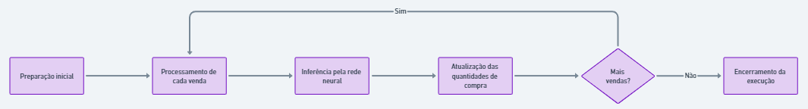

### Passo a passo de treinamento do agente

**1. Inicialização do ambiente de treinamento:** o ambiente de treinamento, como já definido anteriormente, são basicamente as operações de compras e vendas com suas respectivas informações, além do alvo do agente, que é a rentabilidade mais próxima dos 100% do CDI.

**2. Definição da política inicial:** O agente começa com uma política inicial, que pode ser aleatória ou baseada em alguma heurística simples. Essa política determina como o agente escolhe suas ações com base dos estados. Um exemplo de heurística poderia ser definida para que o agente calcule o preço médio de compra ideal com base no preço médio de cada venda venda e na rentabilidade desejada de 100% do CDI. Depois de, para cada venda, determinar esse preço ideal de compra, o agente prioriza escolher operações de compra cujos preços médios sejam próximos a esse valor calculado.

**3. Interação com o ambiente e recompensa:** O agente começa a interagir com o ambiente seguindo sua política inicial, ou seja, começa a iterar pelas vendas e para cada venda, seleciona a quantidade de cada compra que deverá ser utilizada para a venda. Ao final de cada episódio, caracterizado pelo casamento de uma venda, o agente recebe uma recompensa com base na proximidade da rentabilidade dessa combinação realizada com os 100% do CDI, permitindo que a cada episódio sua estratégia seja ajustada. Além das recompensas por episódio, o agente também recebe uma recompensa cumulativa que considera a rentabilidade média e o desvio padrão das rentabilidades de todas as vendas já processadas. Isso incentiva o agente a não apenas focar na rentabilidade de combinações individuais, mas também a buscar consistência em suas decisões ao longo do tempo, aproximando a rentabilidade média de todas as vendas à faixa desejada de 100% do CDI, com um desvio padrão baixo.

**4. Ajuste da política:** O agente atualiza sua política com base nas recompensas recebidas, aprendendo a tomar ações mais assertivas a cada episódio.

**5. Iteração até a convergência:** O processo de tomar ações, avaliar a rentabilidade, receber recompensas e ajustar a política é repetido por muitas iterações, até que um critério de parada, previamente definido, seja atingido.

**6. Validação e testes:** A política aprendida é testada em um ambiente ainda não visto para garantir que o agente de fato aprendeu e é capaz de generalizar bem suas estratégias para novos dados.

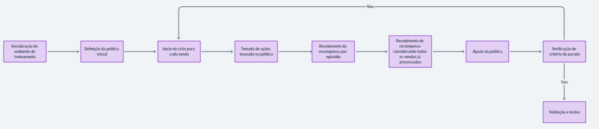

### Estrutura da Rede Neural

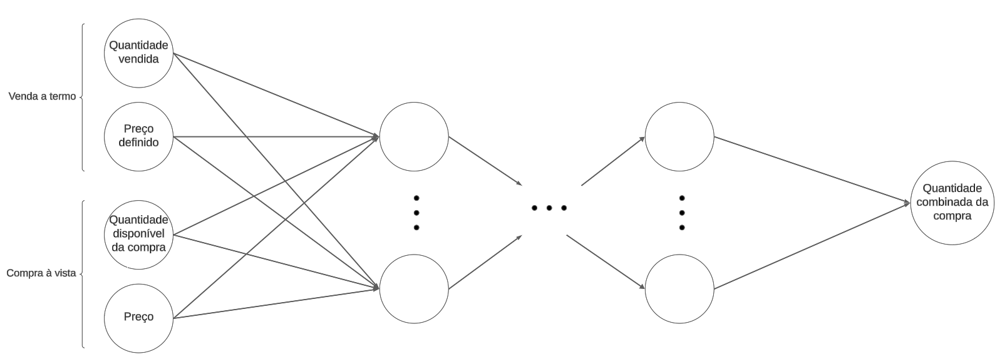

A estrutura definida acima representa a modelagem feita das camadas da rede neural que será utilizada no projeto.
Ela consiste da **camada de entrada, camadas intermediárias/ocultas e camada de saída**:
1. **Camada de entrada**: Será recebido como input uma venda a termo específica e todas as compras à vista que possam ser combinadas para preencher essa venda, ou seja, compras que possuam o mesmo cliente, ativo, corretora e data em relação à da venda.
2. **Camadas ocultas**: São nessas camadas que a rede processa a entrada e gera as saídas finais. Como versão inicial da estrutura, ainda não foi definido mais especificamente como serão estruturadas essas camadas.
3. **Camada de saída**: A saída da rede terá a mesma quantidade de neurônios que a quantidade de compras recebidas, sendo cada saída a quantidade que será usada de uma compra para a combinação final.

## Proposta de funções de recompensa

As funções de recompensa representam um componente fundamental no campo da aprendizagem por reforço. Essas funções são essenciais para guiar os agentes, atuando como um sistema de feedback que informa o valor ou a qualidade de uma ação executada em um determinado estado. A importância dessas funções reside em sua capacidade de moldar o comportamento do agente, incentivando-o a tomar decisões que maximizem a recompensa acumulada ao longo do tempo.

Para avaliar a eficácia e a precisão das funções de recompensa desenvolvidas, utilizamos uma abordagem que inclui tanto verificações de sanidade quanto testes em cenários específicos. As verificações de sanidade garantem que as funções de recompensa estejam logicamente coerentes e livres de erros evidentes, proporcionando uma base sólida para testes mais aprofundados. Posteriormente, as funções são testadas em diversos cenários, onde é possível prever o comportamento esperado do agente. Esses testes são cruciais para validar se as funções de recompensa estão alinhadas com os objetivos desejados e se são capazes de orientar o agente de forma eficaz em situações variadas. Ao examinar como o agente responde em diferentes contextos e se adapta às condições impostas, podemos obter insights valiosos sobre a adequação e a robustez das funções de recompensa implementadas.

Todo o código fonte dessas funções e testes implementados podem ser acessados através do Colab abaixo: [Link para o Colab](https://colab.research.google.com/drive/1rTEqtSJTEKHKpZ_U6RjKWbj36OnqMTie?usp=sharing).

### Funções auxiliares

#### Função `calcular_cdi`
A função `calcular_cdi` desempenha um papel crucial no projeto BTG Pactual, onde se calcula o Certificado de Depósito Interbancário (CDI) considerando vários parâmetros financeiros. Esta função é fundamental para avaliar o desempenho dos investimentos no contexto do projeto. O CDI é calculado com base no número de dias úteis, o preço médio de compra e venda, e a taxa DI. A função utiliza uma fórmula padrão proposta no TAPI para calcular a rentabilidade anualizada, que posteriormente determina o valor do CDI.

##### TESTE PROPOSTO

Utilizando a mesma lógica proposta em uma das soluções do TAPI, replicamos para o código:

**Parâmetros**
- Preço Médio Venda: 58.946802
- Preço Médio Compra: 58.36317
- Quantidade de dias úteis: 19
- Taxa DI: 11.295%

*Resultado Esperado:* Aproximadamente 124% do CDI

*Resultado Obtido:* 124.9024958621961


#### Função `avaliar_cdi_e_variancia`
Esta função tem como objetivo avaliar a recompensa com base no CDI calculado e na variação de preços. Ela incorpora diferentes cenários para alocar a recompensa, adaptando-se a vários contextos de mercado:
- Quando o CDI está dentro de um intervalo considerado adequado, uma recompensa fixa é atribuída.
- Se o CDI exceder o valor máximo desejável, mas for inferior a 120, a recompensa é ajustada de acordo com a distância desse limite superior.
- A função também incentiva o investimento fracionado, avaliando a eficiência da fragmentação das quantidades compradas.
- Em cenários onde há um aumento na variação de preços, recompensas adicionais são concedidas, sugerindo uma preferência por estratégias capazes de diversificar a combinação.

*Obs.: Não foram feitos testes de sanidade para esta lógica, pois não foi considerado necessário, tendo em vista os testes de cenários para a função de recompensa abaixo*

#### Função `recompensa_1`

Esta função principal calcula a recompensa final, levando em consideração vários aspectos e do desempenho do investimento:

- Considera a quantidade de ações adicionadas, o preço médio de compra e venda, a variação de preço anterior, o CDI anterior, a taxa DI, o preço da nova ação e se o investimento é fracionado.
- Ajusta a recompensa com base na comparação entre os valores antigos e novos do CDI, além da variação de preços.
- Impõe penalidades para situações onde o CDI é extremamente alto ou baixo, indicando desempenhos de investimento indesejáveis.
- A recompensa é projetada para encorajar estratégias que maximizem o CDI dentro de um intervalo desejável e que gerenciem eficientemente as variações de preço.


#### Contexto e Conclusão
Para testar esta função utilizamos cenários e monitoramos a performance da recompensa de acordo com premissas pré-determinadas.

1. Os cenários 1 e 2 propuseram um CDI ideal, avaliando como os parâmetros de fracionamento mudariam a recompensa. É visto que o fracionamento e uma maior variância resultam em um aumento constante da recompensa.

2.. Dados os cenários de alto e baixo CDI, são irrelevantes os parâmetros de fracionamento e variância, visto que o objetivo principal não foi alcançado.

Os resultdos obtidos atestam o que foi proposto como pode ser visto abaixo:

```md
**Cenário 1.A Recompensa 1: cenário de CDI ideal, variância nova maior que a antiga, não fracionado**

Recompensa :  2.001
CDI:  101.87949115173328 %
Diferença da variância:  2852.6269999999963 %


**Cenário 1.B Recompensa 2: cenário de CDI ideal, variância nova menor que a antiga, não fracionado**

Recompensa :  1.001
CDI:  101.87949115173328 %
Diferença da variância:  -67.45873333333337 %


**Cenário 2.A Recompensa 1: cenário de CDI ideal, variância igual que a antiga, fracionado **

Recompensa :  2.001
CDI:  100.01177284573097 %
Diferença da variância:  -0.0 %


**Cenário 2.B Recompensa 2: cenário de CDI ideal, variância igual que a antiga, não fracionado **

Recompensa :  1.001
CDI:  100.01177284573097 %
Diferença da variância:  -0.0 %


**Cenário 3: cenário de CDI baixo **
Recompensa :  -0.999
CDI:  48.2950198561134 %


**Cenário 4: cenário de CDI alto **
Recompensa :  -0.999
CDI:  211.31023784861455 %
```

O código completo pode ser executado através do [Colab Original](https://colab.research.google.com/drive/1rTEqtSJTEKHKpZ_U6RjKWbj36OnqMTie?usp=sharing) ou através do [Arquivo no Repositório](../codigo/20240303_funcoes_de_recompensa.ipynb)

#### Função `recompensa_2`

Esta função de recompensa utiliza a mesma lógica da primeira função; contudo, tem o intuito de comparar o comportamento da recompensa ao retirar o corte de distância e a variância da lógica.

O comportamento esperado é que haja um valor, mesmo que quase insignificante, nos casos onde há fragmentação, mas há valores muito altos.

```md
Cenário 1.A Recompensa 1: cenário de CDI ideal, fracionado

Recompensa :  2.001
CDI:  101.87949115173328 %


Cenário 1.B Recompensa 2: cenário de CDI ideal, não fracionado

Recompensa :  1.001
CDI:  101.87949115173328 %


Cenário 2.A Recompensa 1: cenário de CDI alto,
fracionado

Recompensa :  0.0009999999999998899
CDI:  189.04415917916734 %


Cenário 2.B Recompensa 2: cenário de CDI alto, não fracionado

Recompensa :  -0.999
CDI:  189.04415917916734 %


Cenário 3.A: cenário de CDI baixo, fracionado

Recompensa :  0.0009999999999998899
CDI:  -18.356326596703497 %


Cenário 3.B: cenário de CDI alto, não fracionado
Recompensa :  -0.999
CDI:  15.957738137394392 %
```

A fim de compreender os comportamentos das funções ao receberem valores entre 106% e 120%, elaboramos uma forma abrupta de mensurar a tendência de distribuição para valores randômicos que gerem CDIs nessa faixa.

Abaixo estão os gráficos gerados. Vale ressaltar que esta é uma análise rudimentar e menos clínica para avaliar as distribuições, limitando-se ao escopo inicial desta sprint. Mais estudos e análises serão realizados ao longo da evolução do projeto.

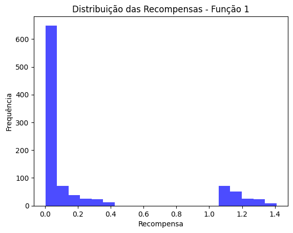

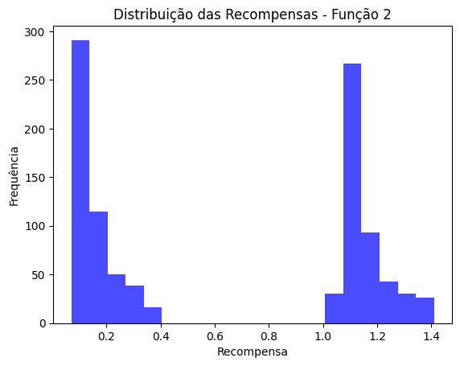

É perceptível, portanto, que o corte por distâncias e variância tende a proporcionar valores de recompensa menores. Os próximos passos para avaliar as funções de recompensa são gerar análises de sensibilidade dos parâmetros e testes A/B entre as funções.

#### Função `recompensa_3`

A terceira função levaria em consideração a criação de um segundo agente. Este agente seria responsável por identificar combinações elegíveis para troca de ações entre si. O propósito da troca seria melhorar os valores de CDI dessas combinações e garantir que a dispersão entre elas seja menor.

A recompensa será atribuída por um valor constante de **1** caso haja melhora nos valores das combinações, sendo que a maior recompensa será dada às rentabilidades que estejam dentro da faixa **[100, 105]**, que seria nossa faixa de valor ótimo. Por outro lado, para valores entre **[106, 120]**, será feita uma ponderação na recompensa, ou seja, quanto mais próximo de 100, maior será a recompensa.

Por fim, caso a troca não seja favorável para as combinações, ocorrerá uma penalidade de valor constante de **-1**.

Abaixo, foi simulado dois cenários com o objetivo de confirmar os resultados da função de recompensa.


**Cenário Positivo**

Após as trocas de ações entre as combinações, houve um impacto positivo, devido a rentabilidade de maior valor conseguir se estabilizar e se encaixar na faixa de valor ótimo de CDI, no caso, houve mudança de 106 para 105.

Outrora, é importante salientar, que a outra combinação teve sua rentabilidade ainda permanecendo dentro da faixa de valor ótimo de CDI, ou seja, de 103 para 104.

```python
resultado = recompensa_3(106, 105, 103, 104)
print(resultado) # 2.001
```

**Cenário Negativo**

A partir das trocas, as rentabilidades das duas combinações tiveram impactos negativos. No sentido de que a primeira combinação em que havia necessidade de diminuição, houve aumento, e a segunda combinação invés de aumento houve diminuição.

Consequentemente, houve maior dispersão entre as rentabilidades, e a situação se agravou, devido a uma das rentabilidades sair da faixa de valor ótimo, no caso, foi de 100 para 99.

```python
resultado = recompensa_3(107, 108, 100, 99)
print(resultado) # -0.999
```

#### Função `recompensa_4`
A função de recompensa 4 é projetada para avaliar e incentivar a eficiência no tempo. A ideia central é premiar o agente se ele conseguir alcançar um desempenho (medido pelo CDI) em um tempo igual ou menor do que o tempo anterior.

```python
# Cenário 1: Tempo Final Pior, mas Distância Melhor
cdi_novo_1 = 101
cdi_antigo_1 = 102
tempo_final_1 = 10
tempo_anterior_1 = 8
resultado_1 = recompensa_4(cdi_novo_1, cdi_antigo_1, tempo_final_1, tempo_anterior_1)

# Cenário 2: Bom Tempo Final e Distância Melhor
cdi_novo_2 = 101
cdi_antigo_2 = 103
tempo_final_2 = 7
tempo_anterior_2 = 8
resultado_2 = recompensa_4(cdi_novo_2, cdi_antigo_2, tempo_final_2, tempo_anterior_2)

# Cenário 3: Pior Distância, mas Melhor Tempo
cdi_novo_3 = 105
cdi_antigo_3 = 102
tempo_final_3 = 7
tempo_anterior_3 = 8
resultado_3 = recompensa_4(cdi_novo_3, cdi_antigo_3, tempo_final_3, tempo_anterior_3)

resultado_1 #0.001
resultado_2 #1.001
resultado_3 # -0.999
```

O código completo pode ser executado através do [Colab Original](https://colab.research.google.com/drive/1rTEqtSJTEKHKpZ_U6RjKWbj36OnqMTie?usp=sharing) ou através do [Arquivo no Repositório](../codigo/20240303_funcoes_de_recompensa.ipynb).

# Relatório Final

O seguinte relatório tem como objetivo apresentar o projeto como um todo, seguindo por seções que abordam: descrição detalhada do problema, a solução desenvolvida, resultados obtidos e lições aprendidas ao longo do projeto.

## Descrição do Problema

Contextualizando o problema, o banco de investimentos BTG Pactual trouxe um case para os alunos do quinto período de Ciência da Computação. O problema em questão a ser mitigado engloba o contexto da negociação a termo, ou seja, um grupo de investidores investe em ações que serão combinadas dentro de um contrato com a ponta a termo, surgindo o "ativo sintético de renda fixa". Esta ponta a termo se caracteriza pelo preço pelo qual a ação será vendida futuramente. O ganho do investidor se denota na venda da ação já objetivando 100% do CDI ou sua aproximação desse valor, como se fosse uma taxa pré-fixada proveniente da escolha da renda fixa.

Foi vista a parte conceitual da operação recorrente desse ativo, denominado "carry and cash", mas tendo como panorama o processo interno do banco diante de tal situação, nos dias atuais, o funcionário, conhecido como Broker, tende a fazer o processo de combinação das ações da ponta vista para a ponta a termo, levando em consideração o valor adequado de CDI, manualmente, tendo como sua principal ferramenta o Excel. O processo operacional feito pelos funcionários do banco se tornou uma oportunidade para a automatização e a inovação usando Inteligência Artificial (IA), para consequentemente, haver agilidade nos processos de combinação.

Contudo, diante do exposto, o problema gira em torno do processo, nos dias de hoje, ser manual, trazendo assim alguns riscos, como: maiores chances de ocorrer a transferência de riqueza entre os investidores, como por exemplo um alavancar o outro; menor assertividade no preço; impedimentos para ganho de escala. Destarte, imposto a situação, abaixo haverá a solução trazida pelo grupo para a mitigação da problemática trazida, e com isso, atendendo às expectativas da empresa BTG Pactual.

## Solução Desenvolvida

A partir do case trazido e das questões provenientes deste caso, e considerando o princípio de utilizar a IA para a construção do projeto em si. A seguinte solução consiste no uso do Reinforcement Learning (RL). Essa vertente da IA condiz no uso de um Agente, que, simplificando o seu significado, aprende com incentivos, seja por recompensa ou penalização. Abaixo, segue a descrição de cada item essencial para a construção do modelo que fará as combinações englobando todos os conceitos essenciais do RL.

Primeiramente, o RL necessita das definições do ambiente com seu pré-processamento, ações, estado, funções de recompensa, algoritmo escolhido para o Agente, arquitetura da rede neural, condição de critério de parada e o que faz sentido como definição de episódio e passos dentro do treinamento do Agente. Abaixo, segue uma descrição em tópicos de cada item essencial do ponto de vista técnico de código.

- Base de dados: Foi usada a base de dados de compra e venda do ano de 2023.

- Pré-processamento: Foi calculado os dias úteis (DU) de cada venda, baseado nas datas de operação e vencimento. Além disso, foi feito um filtro de separação de cada venda levando em consideração as seguintes colunas: Cód. Cliente, Dt. Operação, Cód. Corretora, Cód. Título. Por fim, foi feita a junção de todas as operações de compra dentre as suas respectivas vendas, e cada junção feita foi criado um dataframe e este se tornou um item numa lista em Python.

- Ambiente: O ambiente recebe uma lista com os dataframes pós-processamento e os coloca dentro de um atributo. Esta lista irá perpetuar por todo o treinamento, pois servirá para fins de atualização do ambiente. Dentre os principais atributos, existe o espaço de observação que será usado como entrada para a rede neural, no caso, é composto por quatro itens: "quantidade disponível de venda" (quantidade ainda não casada com alguma compra), "quantidade disponível de compra" (olhando a quantidade de ações sob uma operação de compra que ainda não foram casadas com as ações a termo), "delta preço ideal - atual" (variação entre os dois valores sempre objetivando a variação zero), "quantidade casada" (quantidade que já foi casada focando na operação de compra avaliada no momento). Diante da perspectiva do espaço de ações, existem somente cinco ações possíveis, em que seu escopo consiste em casar ou descasar metade ou tudo, ou apostar em não fazer nada. Dentro da construção da classe que forma o ambiente é importante citar e explicitar os métodos que o compõem: reset (reinicia para o estado inicial, isto é, a cada venda que for passar irá ser feito esse reset); step (método que recebe uma aposta de uma ação e a partir dela parte para outro estado com as atualizações necessárias dentro do dataframe, e por fim, acontece o cálculo da recompensa); get_state (método usado para pegar o estado corrente pós atualizações no ambiente); update_data (método usado para atualizar diretamente o dataframe); render (método usado por motivos de visualização e de debug).

- Ação: Foi citado no tópico anterior uma breve explicação de uma ação, porém aprofundando mais, tendo em vista o escopo no ambiente e a aposta feita pelo Agente, esta aposta irá seguir a trajetória de atualizar o ambiente, depois haverá cálculo da recompensa. É importante notar que esta situação que acontece no método é análoga a um fluxograma originado pelo RL, começa por um estado, depois é tomada uma ação que leva para outro estado, e que para finalizar ocorre o cálculo da recompensa.

- Função de recompensa: A recompensa ou penalização é aplicada dentro do método step, e ela contém seus casos de uso, o principal destes condiz em aplicar uma recompensa caso, após a ação, o preço médio se aproxime do preço ideal, mas se houver ao contrário ocorrerá a penalização. Outrossim, se a escolha do Agente permanecer como não fazer nada várias vezes pelas iterações acontecerá penalização. Se houver situação que ocorreu casamento dentre todas as ações da ponta termo, porém não houve alcance de intervalo de CDI bom, então haverá recompensa ponderada, no entanto, se o CDI for negativo haverá penalização severa. E por último, se a quantidade de passos corrente chegar ao limite permitido de passos também incitará uma penalização.

- Critério de parada: Se não houver mais ações a termo a serem casadas com as da ponta vista, então haverá mudança de atribuição ao atributo "done", garantindo que ele seja "True". Todavia, se o número de passos ser igual ou passar do número de passos máximo (quantidade de operações de compra vezes cinco), então haverá uma parada forçada.

- Episódio e passo: O que condiz um episódio é uma venda aleatória que será avaliada pelo Agente, e cada passo de uma venda específica se adere a uma operação de compra.

- Arquitetura da rede neural: 24 neurônios para três camadas; 4 camadas foram feitas, lembrando que a primeira recebe os inputs e a última o output condizente com a aposta do Agente referente ao escopo de ações; todas as camadas utilizam o "relu" menos a última que considerou a "linear"; foi usado o Erro Médio Quadrático (MSE) para auxílio na diminuição da variação entre o valor previsto e o valor alcançado.

- Agente: Responsável por escolher apostar em alguma ação de modo a favorecer a recompensa total. A cada passo feito do Agente ao ambiente, ele busca sempre combinar, descombinar, ou não fazer nada em relação a um conjunto de ações numa operação de compra dentre um conjunto não casado de ações na venda. Seu processo de escolha a cada operação de compra melhora durante o treinamento, e seguindo uma boa prática de não enviesar o Agente, a escolha da venda posta num episódio se tornou um processo randômico.

- Algoritmo de RL escolhido: Foi feito um algoritmo sem o auxílio de bibliotecas de RL para a construção do Deep Q-Network (DQN). Foi escolhido este algoritmo devido a primeiramente convergir mais rapidamente num resultado, garantir atualização da rede a cada passo e com a inserção da rede neural a capacidade de aguentar grande dimensionalidade de ações e de entrada. Ademais, o algoritmo segue uma abordagem e-greedy, ou seja, considera o equilíbrio entre exploração e exploração de modo que a cada iteração haja diminuição da exploração, neste caso, seria o decaimento de "e".

Destarte, é importante salientar as tecnologias que compuseram o projeto, dentre as principais estão: a linguagem Python, o uso das bibliotecas do Tensor Flow para a construção da rede neural e o uso da biblioteca Gym para a construção do ambiente. Na próxima seção, serão vistos os resultados obtidos oriundos do modelo feito.

## Resultados Obtidos

A partir do modelo, os resultados são oriundos do Agente pós treinamento num contexto de teste. Foi usada uma cópia extra dos dataframes que são as vendas com suas respectivas compras do ano de 2023, em que cada dataframe foi submetido ao teste e o que será considerado sucesso dentre essa operação é que a combinação feita pelo Agente atinja a faixa de valor entre 99 e 105 de CDI.

Após breve contexto do caso de teste sob os dataframes, o modelo teve uma ótima reação. Se levar em consideração que dentro da base de dados continham um número significativo de situações que agregariam outliers devido a serem casos impossíveis de se obter um valor aceitável dentro da faixa de CDI, que no caso seria entre 90 e 120 (faixa de valor aceitável, relembrando que a faixa ideal é entre 99 e 105 de CDI) o modelo fez o melhor que ele pode nesses casos, ou seja, quando havia um dataframe que dava outlier, o resultado final da combinação trazia um valor não tão distante da faixa aceitável, sendo assim, uma prova da boa performance do Agente.

Em termos de quantidade, o modelo atingiu um resultado em torno de 50% de casos com combinações dentro da faixa aceitável, visto que nesse conjunto havia outliers. Se houver retirada dos outliers, os resultados sobem girando em torno de 80%, e consequentemente a porcentagem de combinações que obtiveram valores dentro da faixa ideal de CDI vai subir.

Portanto, é possível concluir que o modelo atingiu alta performance nesta avaliação, visto que grande parte das combinações mantiveram resultados aceitáveis dentro da faixa aceitável utilizada como parâmetro. Em termos visuais, dentro do modelo feito no Google Colab, publicado dentro desse repositório, e visto gráficos demonstrando a distribuição de CDIs pós combinações, e a partir disso, é visto que grande parte dos valores obtidos se concentram na posição que agrega o intervalo de faixa aceitável comprovando, assim os pontos trazidos acima de modo visual.

## Aprendizagem durante a construção do Projeto

Durante a construção da solução, a equipe responsável por ela teve vários insights e evoluções. Serão abordadas tanto na perspectiva técnica como também em habilidades importantes como senso crítico e capacidade analítica aprimoradas durante o desenvolvimento do projeto.

Partindo no ponto de perspectiva técnica, o time começou o projeto fazendo as primeiras modelagens pós entendimento do problema, modelagens essas que foram mudando durante o percurso das sprints. No final, foi garantida uma modelagem definitiva seguindo as boas práticas do Open AI e implementada via código. Porém, é importante enfatizar as várias tentativas feitas pelo time, no sentido de, por exemplo, mudar hiperparâmetros para ver a reação do próprio modelo, sendo este processo iterativo essencial para a definição oficial de todo o escopo do projeto, no quesito arquitetura da rede e escolhas pertinentes de como seria o Agente e sua interação com o ambiente.

Ademais, foi dito no parágrafo anterior um exemplo de processo iterativo feito durante o projeto. Essa prática iterativa é análoga aos testes feitos pelo grupo. O time fez testes focados principalmente em avaliar a performance do Agente pós treinamento. Outros testes foram focados em balancear a taxa de exploração e exploração, mudanças da função de ativação, colocar em prática outros algoritmos de RL, no caso o Proximal Policy Optimization (PPO) que não teve um resultado tão satisfatório comparado ao DQN, e por fim, o componente de maior mudança e avaliação pelo grupo foi o Ambiente, focado principalmente no aspecto de testar diferentes abordagens de recompensa, de modo a sempre favorecer uma faixa ideal de CDI.

Segundamente, se olhar na perspectiva de soft skills do time, é notável dizer que houve uma grande evolução tanto de capacidade analítica como senso crítico, características essenciais para um profissional de dados em qualquer nicho do mercado. Fica visível essa evolução durante o processo de repensar o projeto como todo no sentido de melhorar. Foram feitos muitos ajustes até que o modelo ficasse coerente com as expectativas do grupo e do parceiro BTG. Esta operação de repensar demandou bastante atenção aos detalhes e uma condução baseada em bastante questionamento até chegar num modelo que faça maior sentido e seguisse as regras de negócio impostas pelo case e pela empresa BTG Pactual.

Concluindo, é vital enfatizar a melhora do time e a interação produtiva com o parceiro que trouxe ótimos insights e conhecimento de negócios sob o nicho do mercado financeiro. O projeto está aberto a futuras modificações e tem o time para futura implementação ou auxílio.

## Referências bibliográficas
Gao, Yiran. **Empirical Study on Stock Index Futures Arbitrage and Relationship with Spot Index Based on CSI300 Stock Index Futures**. Xi’an Jiaotong-Liverpool University, Jiangsu, China, 2023.

Sun, Qiguo et al. **GraphSAGE with deep reinforcement learning for financial portfolio optimization**. School of Computer Science and Engineering, Jiangsu University of Science and Technology, Zhenjiang, 212003, Jiangsu Province, China. Fenyang College of Shanxi Medical University, Fenyang, 032200, Shanxi Province, China. 2024.

Krasheninnikova, Elena et al. **Reinforcement learning for pricing strategy optimization in the insurance industry**. BBVA Data & Analytics, Spain. Universidad Carlos III de Madrid, Spain. 2024.

Yan, Dong et al. **Deep reinforcement learning with credit assignment for combinatorial optimization.** Tsinghua University, 30 Shuangqing Rd, Haidian District, Beijing, China. 2021.

Jang, Junkyu, and Seong, NohYoon. **Deep reinforcement learning for stock portfolio optimization by connecting with modern portfolio theory.** Management Engineering Department, College of Business, Korea Advanced Institute of Science and Technology, Seoul, Korea.

Wekwete, Takura Asael, et al. **Application of deep reinforcement learning in asset liability management.** Department of Computer Science, University of Pretoria, Pretoria, South Africa.

Tang, B., Liang, J., Cai, Z., Zhou, X., Chen, Y., & Cai, T. (2023). **MDRL-IR: Incentive Routing for Blockchain Scalability With Memory-Based Deep Reinforcement Learning**. IEEE Transactions on Services Computing. DOI: 10.1109/TSC.2023.3323647.
